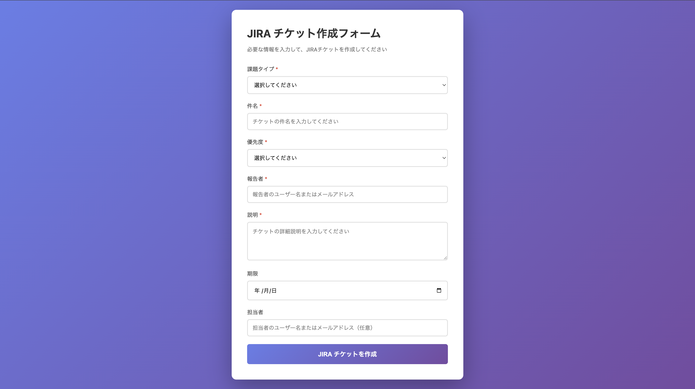
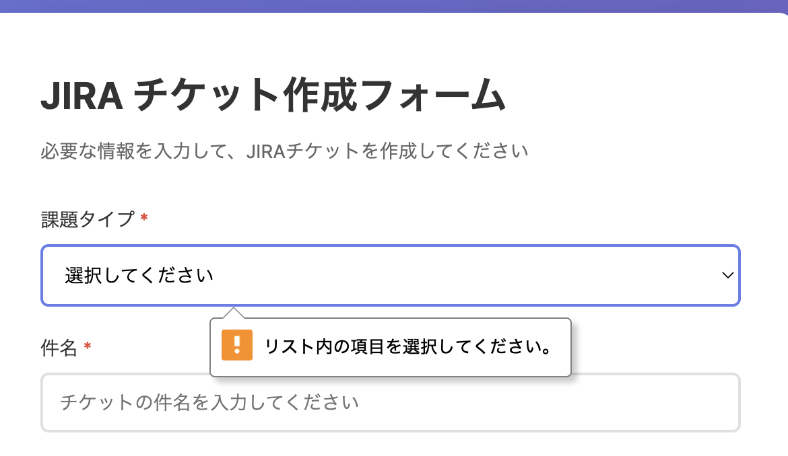
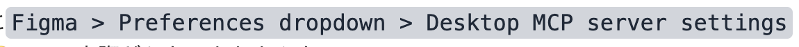

# ChatGPTくん、仕事できるの？<br>できないの？

<div class="white">

業務で使い倒した結果報告

</div>

<!--
「ChatGPTくん、仕事できるの？できないの？」と題して〇〇が発表いたします。
-->

---

# 📋 目次

<div class="text-xl space-y-3 mt-8">

- 🙋 自己紹介
- 💡 イントロダクション
- 💻 コーディングでの利用
- 🔍 コードレビューでの利用
- 🔎 調査タスクでの利用
- 🤔 仕事で使えるの？
- 📌 まとめ

</div>

<!--
本日のアジェンダは記載の通りです。  
こんな感じのことを話していければと思います。  
ちなみにタイトルでChatGPTくんと言っていますが、実際には色々な生成AIツールを業務で使ってみた結果を共有いたします。
-->

---

# 🙋 自己紹介

## SNS
- 他: @tminasen

---
layout: center
class: text-center
---

# 💡 イントロダクション

<!--
早速本題に入っていければと思います。
-->

---

# 💡 イントロダクション 1/2

<div class="text-xl mt-8">

## みんな生成AI使ってる？

<div class="mt-8">

### こんな仕事ない？

- 😮‍💨 実質作業になってるリファクタリング
- 🧪 テストコードの実装
- 📊 調査依頼
- 📄 資料作成
- などなど

</div>

<div v-click>

<div class="mt-8 text-3xl text-orange-400 font-bold">
やりたくないよね？全部AIに頼んじゃおう 🚀
</div>

</div>

</div>

<!--
みなさん生成AI使ってますか？  
個人的に使ってるよとか業務で使ってるよって方いますかね？  
〜〜〜ちょっと反応見る〜〜〜
ありがとうございます。  

* 結果見ていい感じのこと言う
  * やってる人多い： みんなやってるよね
  * やってる人少ない： まだあんまり使ってる人いないよね

ところで、みなさんこんな仕事ないですか？
- 考えることが終わって実質作業やるだけのリファクタリング
- テストコードの実装
- 調査依頼
- 資料作成
などなど。

楽しいものもあると思いますが、基本的にはちょっとやりたくないよな。と思うことが多いのでは無いでしょうか？
そんな時は全部AIに頼んじゃいましょう！
-->

---

# 💡 イントロダクション 2/2

<div class="grid grid-cols-2 gap-8 mt-8">

<div>

## ✅ 話すこと


- 業務で生成AI使って良かったなと思ったこと
- 簡単な例の紹介

</div>

<div>

## ❌ 話さないこと

- AIツールの細かい使い方
- プロンプトの書き方
- MCP

</div>

</div>

<!--
今日お話ししようと思っていることと、話さないことについては記載の通りです。  
実際業務で使って良かったなと思ったことと簡単な例の紹介を話せればと思います。  
逆に、細かいAIツールの使い方やプロンプトの書き方、MCPなどについては今回は話しません。
-->

---
layout: center
class: text-center
---

# 💻 コーディングでの利用

<!--
では実際に良かった事例を紹介していければと思います。  
まずはコーディング周りについてです。
-->

---

# 💻 コーディングでの利用 1/12

<div class="text-2xl mt-8">

## 👨‍💻「新しいAPI作ってって言われたけど、あの処理と同じなんだよな...」

<v-clicks>

<div class="mt-12 text-center">

### 👉 AIに任せましょう 🤖

</div>

</v-clicks>

</div>

<!--
例えば業務において、新しいAPI作ってとかこんな機能欲しいなって言われることないですか？  
しかもそれってあの機能の流用、改修でいけそうだよな〜ってなる時です。  
まぁもし無かったらあったと言うことにしておいて下さい。  
そんな時はAIに任せましょう。
-->

---

# 💻 コーディングでの利用 2/12

## 🎯 デモ用コード（既存実装）

<TerminalWindow title="UserController.ts" class="w-full">

```tsx
export class UserController {
  constructor(private readonly getUsersUseCase: GetUsersUseCase) {}

  async getUsers(req: Request, res: Response): Promise<void> {
    try {
      // クエリパラメータの取得
      const page = req.query.page ? parseInt(req.query.page as string, 10) : undefined;
      const limit = req.query.limit ? parseInt(req.query.limit as string, 10) : undefined;
      // ユースケースの実行
      const result = await this.getUsersUseCase.execute({ page, limit });
      // 成功レスポンス
      res.status(200).json(result);
    } catch (error) {
      // エラーハンドリング
      if (error instanceof Error) {
        res.status(400).json({
          error: { message: error.message, code: 'BAD_REQUEST' }
        });
      } else {
        // その他ハンドリング
```

</TerminalWindow>

<!--
仮にこんな実装があったとして下さい。  
TypeScript+ExpressでUser取得APIを実装しています。  
こちらのAPIは4層のLayered Architectureになっており、Controllerからapplication層のUseCaseを呼び出してUserRepositoryを通じてDBからユーザー情報を取得しています。  
ページングの機能が実装されていて、クエリパラメータでpageとlimitを受け取ってユーザー情報を返すAPIという感じです。  
-->

---

# 💻 コーディングでの利用 3/12

<TerminalWindow title="GetUsersUseCase.ts" class="w-full">

```ts
export class GetUsersUseCase {
  constructor(private readonly userRepository: UserRepository) {}

  async execute(request: GetUsersRequest): Promise<GetUsersResponse> {
    // デフォルト値の設定とバリデーション
    const page = this.validatePage(request.page);
    const limit = this.validateLimit(request.limit);
    const params: PaginationParams = { page, limit };
    // リポジトリからユーザーを取得
    const result: PaginatedResult<User> = await this.userRepository.findAll(params);
    // ドメインエンティティをDTOに変換
    const users = result.data.map(user => this.toDTO(user));

    return {
      users,
      pagination: {
        total: result.total,
        page: result.page,
        limit: result.limit,
        totalPages: result.totalPages,
      },
    };
  }
}
```

</TerminalWindow>

<!--
application層のUseCaseはこんな感じです。  
domain/infrastructure層のUserRepositoryを通じてDBからユーザー情報を取得し、DTOに変換してレスポンスとして返すという感じです。  
この辺の変換処理は良い感じにしてあげる何かが必要だったということにして下さい。  
-->

---

# 💻 コーディングでの利用 4/12

## 📝 AIに投げたプロンプト

<TerminalWindow title="Claude Code" class="w-full">

以下の修正を行なって下さい。

```markdown
# 要件
* 現状のUser取得APIに認証あり版を作成して下さい
* 基本的なロジックは同じでパスを変えて下さい
* レスポンスに`isOwnProfile`という項目を追加し、 自分の情報であればtrueにして下さい
* 認証ありはCookieからリクエストユーザのIdを取得して下さい
* 認証なしは3分間のキャッシュできるようにして下さい
```

</TerminalWindow>

<!--
例えばこのAPIの認証あり版を作って欲しいと頼まれた場合の話です。  
要件としては「認証あり版では自分の情報であればフラグが欲しい」、「認証なし版はキャッシュに載せたい」だったとします。

そんな時はこんなふうにAIに頼みます。  
* 現状のUser取得APIに認証あり版を作成して下さい
* 基本的なロジックは同じでパスを変えて下さい
* レスポンスに`isOwnProfile`という項目を追加し、 自分の情報であればtrueにして下さい
* 認証ありはCookieからリクエストユーザのIdを取得して下さい
* 認証なしは3分間のキャッシュできるようにして下さい

-->

---

# 💻 コーディングでの利用 5/12

<div class="mt-8 text-xl text-green-400">

✨ AIが認証ありAPI + キャッシュ設定を自動実装！

</div>

<TerminalWindow title="UserController.diff" class="w-full text-sm">

```diff
async getUsers(req: Request, res: Response): Promise<void> {
    try {
      const page = req.query.page ? parseInt(req.query.page as string, 10) : undefined;
      const limit = req.query.limit ? parseInt(req.query.limit as string, 10) : undefined;
      const result = await this.getUsersUseCase.execute({ page, limit });
+     // 3分間のキャッシュヘッダーを追加
+     res.setHeader('Cache-Control', 'public, max-age=180');
      res.status(200).json(result);
    } catch (error) {
      // ... エラーハンドリング（変更なし）
    }
  }
```

</TerminalWindow>

<!--
結果どうなったかというとこんな修正をして要件を満たしたAPIを作ってくれます。  
まずはコントローラーですね。  
これは認証なし版の処理なので、レスポンスにCache-Controlヘッダーを追加して3分間のキャッシュを設定しています。
-->

---

# 💻 コーディングでの利用 6/12

<TerminalWindow title="UserController.ts" class="w-full text-sm">

```ts
async getAuthenticatedUsers(req: Request, res: Response): Promise<void> {
  try {
    // Cookieからユーザーidを取得
    const requestUserId = req.cookies?.userId;
    if (!requestUserId) {
      // 〜認証周りのハンドリング〜
      return;
    }

    // クエリパラメータの取得
    const page = req.query.page ? parseInt(req.query.page as string, 10) : undefined;
    const limit = req.query.limit ? parseInt(req.query.limit as string, 10) : undefined;

    // ユースケースの実行（認証あり）
    const result = await this.getUsersUseCase.execute({
      page,
      limit,
      requestUserId, // ← 認証情報を追加
    });
    // 成功レスポンス（認証あり版はキャッシュなし）
    res.status(200).json(result);
  } catch (error) {
    // エラーハンドリング（getUsers と同様）
  }
}
```

</TerminalWindow>

<!--
さらにControllerにこんな感じの認証あり版の関数も生やしてくれます。  
コードが長くなってしまうのでここでは省略させていただいていますが、エラーハンドリング系もちゃんと実装してくれています。
-->

---

# 💻 コーディングでの利用 7/12

<TerminalWindow title="GetUsersUseCase.diff" class="w-full">

```diff
  async execute(request: GetUsersRequest): Promise<GetUsersResponse | GetAuthenticatedUsersResponse> {
    const page = this.validatePage(request.page);
    const limit = this.validateLimit(request.limit);

    const params: PaginationParams = { page, limit };

    const result: PaginatedResult<User> = await this.userRepository.findAll(params);

-   // 修正前: 常に toDTO を使用
-   const users = result.data.map(user => this.toDTO(user));

+   // 修正後: 認証あり/なしで処理を分岐
+   const users = request.requestUserId
+     ? result.data.map(user => this.toAuthenticatedDTO(user, request.requestUserId!))
+     : result.data.map(user => this.toDTO(user));

    return {
      users,
      pagination: {
        total: result.total,
        page: result.page,
        limit: result.limit,
        totalPages: result.totalPages,
      },
-   };
+   } as GetUsersResponse | GetAuthenticatedUsersResponse;
  }
```

</TerminalWindow>

<!--
続いてUseCaseの方もこんな感じで修正してくれます。  
認証あり版と認証なし版でDTO変換の処理を分岐させていますね。  
認証あり版では`toAuthenticatedDTO`という関数を使って`isOwnProfile`フラグを設定しています。  
-->

---

# 💻 コーディングでの利用 8/12

<div class="text-2xl mt-8">

## 👨‍💻「〇〇さんが困ってそうだから、<br>ちょっとしたツールが欲しいんだよな」

<v-clicks>

<div class="mt-12 text-center">

### 👉 AIに任せまs(ry 🤖

</div>

</v-clicks>

</div>

<!--
〇〇さんがやってる困ってるあの作業、ちょっとしたツールがあれば楽になるんだけどな〜って思うことないですか？  
ただ、そんな時間無いよな〜ってなることも多いと思います。  
そんな時もAIに任せましょう。
-->

---

# 💻 コーディングでの利用 9/12

## 📝 JIRAチケット起票フォーム - プロンプト

<TerminalWindow title="Claude Code" class="w-full">

以下の要件に沿ったペライチのページを作成してください。

```markdown
# 要件
* JIRAのチケット入力フォーム
  * JIRAの`Create Issue Link`機能を使って作成したフォームのボタンをクリックすることで別タブでチケットフォームが開く仕様
* 以下の値は固定で入る様にして下さい(ユーザの入力を受け付けずに直接リクエスト時に設定して下さい)
  * pid
* 以下の値は必須項目としてください
  * issuetype: 課題タイプ
  * summary: 概要
  * priority: 優先度
  * reporter: 報告書
  * description: 説明
* 以下の値は任意項目として下さい
  * duedate: 期限
  * assignee: 担当者
* 入力フォームの表示は日本語にして下さい
* 日付はカレンダーから選べる様にして下さい
```

</TerminalWindow>

<!--
今回は簡単なツールを作ってもらう例を紹介します。  
内容としてはJIRAのチケット起票フォームを作って欲しいというものです。  
要件としては以下の通りです。  
* 作成したフォームからJIRAのCreate Issue Link機能を使ってチケットフォームが開く仕様にして下さい
* JIRAのpidは固定値で入る様にして下さい
* issuetype, summary, priority, reporter, descriptionは必須項目にして下さい
* duedate, assigneeは任意項目にして下さい
* 入力フォームの表示は日本語にして下さい
* 日付はカレンダーから選べる様にして下さい
-->

---

# 💻 コーディングでの利用 10/12

## ✨ AIが作成したフォーム（完成形）

<div class="mt-4 text-center text-lg">

カレンダー機能 + バリデーション完備 🎉

</div>

<div class="flex justify-center items-center h-90">
  
</div>

<!--
これでお願いした結果がこちらになります。   
期限はカレンダーから選べる様になっていそうなのとバリデーションも実装されています。  
これ、自分は全く手を加えていないです。AIが全部作ってくれました。  
背景もこういう画像にしてるんじゃなくて、全部AIが自動でやってくれています。  
センスがない自分がデザインするより綺麗で正直びっくりしました。  
何でも良いけど良い感じにならもう人間の出る幕無いなと思いましたね。  
-->

---

# 💻 コーディングでの利用 11/12

## ✨ AIが作成したフォーム（バリデーション）

<div class="mt-4 text-center text-lg">

必須項目の選択を促すエラーハンドリングも実装済み ✅

</div>

<div class="flex justify-center items-center h-90">
  
</div>

<!--
こちらはちゃんとバリデーションが反応する例です。  
実態はブラウザの機能ですが、ちゃんと実装してくれているよという話です。  
-->

---

# 💻 コーディングでの利用 12/12

## 🎯 AIが実装してくれた内容

<div class="grid grid-cols-2 gap-8 mt-8">

<div>

### ✅ 実装された機能

- 必須/任意項目の適切な設定
- HTML5 date inputによるカレンダー
- ドロップダウンの選択肢設定

</div>

<div>

### 🚀 追加でやったこと

**なし！**

<div class="mt-8 text-xl text-green-400">

実装時間: 約5分 ⚡

</div>

</div>

</div>

<!--
まとめるとこんな感じです。  

- 必須/任意項目の適切な設定してくれました
- HTML5 date inputによるカレンダーも実装してくれました
- ドロップダウンの選択肢設定もしてくれています

しかもありがたいことに私がやったことは何もないです。  
実装時間もAIが動いている時間ですが約5分とかかかって数分という感じです。  
これだけで感謝されれば最高ですよね。  
-->

---
layout: center
class: text-center
---

# 🔍 コードレビューでの利用

<!--
続いてはレビューでの利用例を紹介いたします。
-->

---

# 🔍 コードレビューでの利用 1/3

<div class="text-2xl mt-8">

こんなPRないですか？

* 数百行に及ぶ変更……
* file changesは数十にも……
* 見るだけで疲れる……😵‍💫

<v-clicks>

<div class="mt-12 text-center">

### 👉 AIに任せm(ry 🤖

</div>

</v-clicks>

</div>

<!--
例えばこんなPRないですか？  
数百行に及ぶ変更、file changesは数十あり、見るだけで疲れる……みたいなやつです。  
そんな時もAIに任せましょう。  
-->

---

# 🔍 コードレビューでの利用 2/3

## 🎯 AIが問題を発見したコード

<TerminalWindow title="BadExample.tsx" class="w-full">

```tsx
import { useRef } from 'react'
import { useAppSelector } from '../store/hooks'

export function BadExample() {
  const renderCount = useRef(0)
  renderCount.current += 1

  const { name } = useAppSelector((state) => ({ name: state.demo.name }))

  return (
    <div>〜〜</div>
  )
}
```

</TerminalWindow>

<!--
実際にAIが問題を発見したコード例です。  
例えばこんなコードがあったとします。
実例がReactのコードで恐縮ですがこんな感じのコードがあると思って下さい。  
今回見ていただきたいところは `useAppsSelector`となっている箇所です。  
詳しい処理は一旦おいておいて、この関数は戻り値が同じであればキャッシュが効くということと、関数がオブジェクトを返していることに注目して下さい。  

私は流し見でふむふむ特におかしいとこないかなと思いつつ一応AIにレビューを投げました。    
-->

---

## 📝 プロンプト

<TerminalWindow title="Claude Code" class="w-full">

BadExampleについて以下の観点に沿ってレビューしてください。  

```markdown
* パフォーマンス上ネックになるポイントがあれば改善案を提示して下さい
* デファクトスタンダードにのっとった実装になっているか確認して下さい  
```

</TerminalWindow>

<!--
レビュー用のpromptはこんな感じです。  
* パフォーマンス上ネックになるポイントがあれば改善案を提示して下さいというのと
* デファクトスタンダードにのっとった実装になっているか確認して下さいという観点でレビューをお願いしています。

実際に自分が使っているpromptもこんな感じでやってます。  
-->

---

# 🔍 コードレビューでの利用 3/3

## 🚨 AIが見つけたパフォーマンス問題

<TerminalWindow title="Claude Code - レビュー結果" class="w-full text-sm">

❌ useAppSelector のメモ化が効いていない（最重要）

問題点 (8行目):
const { name } = useAppSelector((state) => ({ name: state.demo.name }))

- 毎回新しいオブジェクト { name: ... } を生成するため、
  参照の等価性チェック（===）が常に false
- Redux の state がどこか一箇所でも変更されると、
  必ずこのコンポーネントが再レンダリング
- nameが変わっていなくても無駄な再レンダリングが発生

改善案:
// 方法1: プリミティブ値を直接取得（推奨）
const name = useAppSelector((state) => state.demo.name)

// 方法2: shallowEqualを使用
import { shallowEqual } from 'react-redux'
const { name } = useAppSelector(
  (state) => ({ name: state.demo.name }),
  shallowEqual
)

</TerminalWindow>

<div class="mt-4 text-xl text-green-400">

✨ パッと見で見落としていた問題を発見！

</div>

<!--
結果はこんな感じで、めっちゃ怒られます。    
理由としては記載の通りです。  
JavaScriptのオブジェクト同士の比較はhogeというobjectを作って、huga=hogeくらいのことをしない限り、常にfalseになるので、この実装では毎回新しいオブジェクトを返している状態になっています。  
じゃあこれで何が困るのかっていうのも記載の通りで、Reactは基本的に値が変わったら再レンダリングされるので、レンダリングコストが毎回かかっちゃいますよという話です。  
対策も簡単で、nameしか使わないなら直接name返せよって話です。  
一応二つ目みたいな対策もありますが推奨されている方が良いかなと思います。  

これ何が嬉しかったかというと、もちろん知識としてこのことが起こるのは知ってたし自分でやるならこうは書かないです。  
が、流し見で見落としていたポイントをAIが指摘してくれたことが非常にありがたかったです。  
こういう細かいところを見落としがちがなのでしっかり指摘してくれるのは非常に助かりました。  
-->

---
layout: center
class: text-center
---

# 🔎 調査タスクでの利用

<!--
続いては調査タスクでの話です。
-->

---

# 🔎 調査タスクでの利用 1/5

<div class="text-2xl mt-8">

## 👨‍🏫「〇〇って処理どうなってますか？」

<v-clicks>

自分で調べればわかるけど、探す時間ないな……

<div class="mt-12 text-center">

### 👉 AIに任s(ry 🤖

</div>

</v-clicks>

</div>

<!--
偉い人に〇〇って処理どうなってますか？って聞かれたことないですか？
もちろん調べればわかりますが、今言うか？みたいな気持ちの時あると思います。
そんな時もAIに任せましょう。
-->

---

# 🔎 調査タスクでの利用 2/5

## 📝 プロンプト例

<TerminalWindow title="Claude Code" class="w-full">

こちらのrepositoryにおいて`src/libraries`配下のscriptは<br />どの様な処理をする何のためのファイルなのかファイル単位で説明して下さい。

```
.
├── src
│   ├── libraries
│   │   ├── articles.ts
│   │   ├── date.ts
│   │   ├── image.ts
│   │   └── markdown.ts
│
├── ..... 
```
</TerminalWindow>

<!--
こちら実際の私のブログの構成の一部になります。
今回実際の業務コード伝えるわけにはいかないので、自作のブログを例にしています。  
このブログ仕組みを作ったのが古すぎて、この辺のファイル内容が思い出せないな〜って時がありました。  
そこでAIに調査をお願いした例です。  
-->

---

# 🔎 調査タスクでの利用 3/5
## 🎯 AIの回答

<TerminalWindow title="Claude Code - 調査結果" class="w-full text-xs" font-size="8px">

```markdown
⏺ src/libraries 配下の各ファイルについて説明します。  
**1. date.ts (src/libraries/date.ts)**: 日付文字列の解析と変換を行うユーティリティ  
主な処理:
- parseStringDate() (5-11行目): 文字列の日付をタイムスタンプ(number)に変換
- dateFromDateString() (17-35行目): YYYY/MM/DD形式の文字列からDateオブジェクトを生成
  - GMT対応のため9時に設定
  - バリデーション機能付き
- convertToDecimal() (37-43行目): 文字列を10進数に変換する内部関数
**2. image.ts (src/libraries/image.ts)**: 画像のレスポンシブ対応サイズ計算  
主な処理:
- getImageSize() (19-60行目): 画像のパスと用途(サムネイル/記事)に応じて、PC・SP用のサイズを計算
  - サムネイル用: 336px × 189px (デフォルト)
  - 記事用: PC 800px × 450px / SP 320px × 180px
  - アスペクト比を維持して自動計算
**3. articles.ts (src/libraries/articles.ts)**: ブログ記事のメタデータ管理とタグ処理の中核ライブラリ  
主な処理:
- getArticleMetaData() (18-45行目): content/md-pages 配下の全記事を読み込み、メタデータを抽出
  - マークダウンのfront-matterを解析
  - 更新日降順でソート
- getTagCount() (51-61行目): 記事のタグごとの件数を集計
- convertTagList() (72-82行目): タグ情報を表示用データに整形(タグ名、記事数、URL)
- convertArticleMetaData() (84-105行目): マークダウンをHTMLに変換し、記事の説明文(130文字)を生成
**4. markdown.ts (src/libraries/markdown.ts)**: マークダウンのHTML変換とカスタマイズ処理  
```

</TerminalWindow>

<!--
結果としてはこんな感じです。  
各ファイルについて処理内容をしっかりと回答してくれています。  
ちなみにmarkdown.tsについても回答してくれていますが、長くなりすぎたので省略しています。  
これだとあまり凄さがわからないかもですが、それこそ最初に話した通りこの処理どうなってんだっけ？とかはAIに調べさせて回答したりしています。
-->

---

# 🔎 調査タスクでの利用 4/5

## 🔧 追加質問もスムーズに

<TerminalWindow title="Claude Code" class="w-full">

追加で教えて下さい。 <br />
こちらのprojectではprismjsを利用していると思います。 <br />
テキストのインラインコードのコントラスト比が低いため改善したいです。どこを修正すれば良いでしょうか？

</TerminalWindow>

<div class="mt-4 text-center text-lg">

実際のコントラスト比が低い例 👇

<div class="flex justify-center items-center mt-1">
  
</div>

</div>

<!--
ちなみに、追加質問もスムーズにできます。  
例えばこのブログではprismjsを使ってコードハイライトを実装しています。  
が、気づいたらこんな感じで視力検査か？みたいな色味になってました。  
ライブラリの設定が悪いのかなと思って、AIに「インラインコードのコントラスト比が低いため改善したいのですが、どこを修正すれば良いでしょうか？」と聞いてみました。
-->

---

# 🔎 調査タスクでの利用 5/5

## ✨ AIの回答

<TerminalWindow title="Claude Code - 調査結果" class="w-full text-sm">

⏺ 見つかりました！インラインコードのコントラスト比が低い原因は  
src/styles/templates/mdTemplate.css:120 にあります。  
問題の箇所: 120行目の opacity: 20%; が原因！  
修正方法:

```css
.md-article p > code {
    background-color: var(--color-gray-300);
    /* opacity: 20%; を削除 */
    color: var(--color-gray-800);
    padding: 0.125rem 0.25rem;
    border-radius: 0.25rem;
}
```

</TerminalWindow>


<div class="flex justify-center items-center mt-1">
  
</div>

<!--
結果はこちらの通りです。
ライブラリ濡れ衣で、完全に自分が書いたコードです。  
指摘通り透過しているため色が薄くなっているので、該当コードを消したらちゃんと見やすくなりました。  
直したいけど探すのも面倒だったので、これは非常に助かりましたね。  
-->

---
layout: center
class: text-center
---

# 🤔 仕事で使えるの？

<!--
ここまで色々な利用例を紹介してきましたが、実際の仕事で使えるのか？という話をしていこうと思います。
-->

---

# 🤔 仕事で使えるの？ 1/2

<div class="text-2xl mt-8">

## 使えるっちゃ使えるが、使えないっちゃ使えない 🤷

</div>

<v-clicks>

<div class="mt-8 text-xl">

### 今までの仕事が半分の時間で出来た！

</div>

<div class="text-red-400 font-bold mt-4 text-xl">

❌ は無い。  
自分の生産性がAIで爆上がりした！は無いです。
</div>

<div class="mt-12 text-2xl text-green-400">

## 何が変わった？

* 自分の**手足として働くパートナー**が増えた
* 自分が**150%働ける**様になった感覚
* AIをうまく使える人と使えない人では差が出る

</div>

</v-clicks>

<!--
早速結論ですが、使えるっちゃ使えるが使えないっちゃ使えないという感じです。  
どっちだよって感じなんですが、例えば「今までの仕事が半分の時間で出来た！AIすごい！」みたいなことは無いです。  
自分の生産性が2倍になったとかないです。  

じゃあ何が変わったのかというと自分の手足として働くパートナーが増えた感じです。  
何でもやってくれる後輩とか、自分用の業務委託メンバーがいる感じですね。  
自分がmtg中など動けない時も働いてくれるので、150%働ける様になった感覚が個人的には近いです。  

AIをうまく使えるかどうかでというところについては、AIは結局パートナーに近いというところです。  
人間相手でも指示の出し方次第で、働き方や効率って変わりますよね？  
それと同じで、指示の出し方の上手い人と下手な人で差が出るという印象です。    
やって欲しいこととやって欲しくないことをしっかり伝えられればとても強力なパートナーとして動いてくれると思います。
-->

---

# 🤔 仕事で使えるの？ 2/2

<div class="grid grid-cols-2 gap-8 mt-8">

<div>

## ✅ 使えるポイント

<v-clicks>

<div class="mt-2">

### 単純作業系
- 一定やり方を教えれば勝手にできる様な内容
- 人間がやらなくて良いと思えるレベル

</div>

<div class="mt-2">

### 資料整理系
- 最近notebooklmで感動
- 人間がやらなくて良いと思えるレベル

</div>

</v-clicks>

</div>

<div>

## ❌ 使えないポイント

<v-clicks>

<div class="mt-2">

### 人間が見た方が早いこと
- 数年前のコードもあれば数日前のコードもある様なプロダクト
- AIは確実に実装がブレる

</div>
<div class="mt-2">

### 人間が必要なところ
- AIがやったからOKという世界はまだ来てない
- 最後のボトルネックは人間

</div>

</v-clicks>

</div>

</div>

<!--
仕事で使えるポイントと使えないポイントについてまとめるとこんな感じです。  
使えるポイントとしては、単純作業系です。  
一定やり方を教えれば勝手にできる様な内容についてはもう人間がやらなくて良いと思えるレベルでAIくんは賢いです。AIに任せましょう。  

あとは資料整理系です。  
今日お話ししてない内容で恐縮ですが、最近notebooklmを使い始めたのですが、これが非常にすごいです。
必要なドキュメントを放り込んでおけば要約も資料作成もお手軽かつ高精度でやってくれます。  
使ってるよって方いますかね？  
個人的は情報突っ込んでスライド作成とか、ライブラリのアップデート情報を知りたいのでChangeLog全部突っ込んで破壊的変更教えてくれとか言ったらしたら最高でした。  
要約はわかりやすいし、スライドにイラストはいるしで完璧でした。

逆に使えないポイントとしては、人間が見た方が早いことです。  
数年前のコードもあれば数日前のコードもある様なプロダクトで、AIに実装をお願いした場合確実に実装がブレます。    
人間だったら察して古すぎるコード見ないとかすると思いますが、AIはそういうのができないので、結局人間が見た方が早いということがあります。  

あとは人間が必要なところです。  
残念ながらAIがやったからOKという世界はまだ来ていないです。  
なのでAIのやったことにOKを出すのは人間が出してあげる必要があります。  
どれだけAI頑張ってくれていても最後のボトルネックは人間になります。  
-->

---
layout: center
class: text-center
---

# 📌 まとめ

<div class="text-2xl mt-12">

## AI使って人間は楽していきましょう 🚀

</div>

<!--
まとめになりますが、AI使って人間は楽していきましょうという話でした。  
-->

---
layout: center
class: text-center
---

<div class="mt-8">


<div class="text-2xl text-gray-400 mb-8">

ちなみに...

</div>

<v-clicks>

<div class="text-3xl text-orange-400 font-bold mb-12">

このスライド自体もAIに作ってもらいました 🤖✨

<div class="text-lg text-gray-500 font-normal">

（原稿は人間が書きましたが、スライド化は全部AIにお任せ）

</div>

<div class="mt-16 text-2xl text-gray-500 font-normal">

Thank you for listening! 🎉

</div>

</div>

</v-clicks>

</div>


<style>
/* ベースフォントサイズの調整 */
.slidev-layout {
  font-size: 1.1rem;
  line-height: 1.6;
  padding: 2rem 3rem;
}

/* 通常スライドのタイトルを左上に固定 */
.slidev-layout:not(.slidev-layout-center) h1 {
  text-align: left;
  margin-top: 0.5rem;
  margin-bottom: 1.5rem;
  font-size: 2rem;
  font-weight: 700;
}

/* セクション区切りスライド以外のタイトルを左詰め */
.slidev-page:not([class*="text-center"]) h1 {
  text-align: left;
}

/* h2のサイズ調整 */
h2 {
  font-size: 1.5rem;
  margin-bottom: 1rem;
  font-weight: 600;
}

/* h3のサイズ調整 */
h3 {
  font-size: 1.2rem;
  margin-bottom: 0.75rem;
  font-weight: 600;
}

/* リストのスタイル改善 */
ul, ol {
  margin-top: 0.5rem;
  margin-bottom: 0.5rem;
}

li {
  margin-bottom: 0.5rem;
}

/* コードブロックのフォントサイズ */
pre, code {
  font-size: 0.9rem;
}

/* ページ番号のスタイル改善 */
.slidev-page-number {
  font-size: 0.9rem;
  opacity: 0.7;
  padding: 0.5rem 1rem;
}

/* センターレイアウトの調整 */
.slidev-layout-center {
  padding: 3rem;
}

/* TerminalWindowのコンテンツサイズ調整 */
.terminal-display {
  font-size: 0.85rem !important;
}
</style>

<!--
ちなみに、最後に余談になるのですが、このスライド自体もAIに作ってもらいました。
原案、原稿は私が書きましたがスライド化とかデザインとかやたら絵文字使ってくる表現とかは全部AIにお任せした結果になります。  
ではご静聴いただきありがとうございました。
-->

---
layout: center
class: text-center
---

# 📎 Appendix

---

# ❓ 想定質問 1/3
## Q.「AIへの指示の出し方で差が出る」とおっしゃっていましたが、良いプロンプトを書くために意識していることはありますか？
構造化したデータで指示を出すことを意識しています。  
基本的には日本語かつマークダウンで書いていますが、一部XMLや英語で記載しています。  

## Q. 「色々な生成AIツールを使った」とのことでしたが、タスクによってツールを使い分けていますか？使い分けの基準があれば教えてください。
基本的にはClaudeを使っています。  
コーディング能力が他のモデルよりも優れていると感じているからです。  
他はGeminiとChatGPTも併用していて、AIに質問するときは必ず同じ質問を複数のAIにして結果を比較しています。  

---

# ❓ 想定質問 2/3
## Q.AIが書いたコードに対してテストコードもAIに書かせているのでしょうか？ それとも、人間が動作確認をして終わりとしているのでしょうか？品質担保のバランスについて聞きたいです。
テストコードはAIに書かせています。  
TDDなどの手法で進めてもらい、AIに自身のコードの品質を担保させるようなプロンプトにしています。  
また、AIが書いたコードの動作確認/レビューは人間が行い、最終的な品質担保は人間が行う形にしています。   

## Q. AIを「手足」として使うことで、エンジニア自身のスキルが育たなくなるリスクはないでしょうか？特に若手エンジニアへの影響をどうお考えですか？
何をスキルと取るかによるかなと思います。  
今後はコードを直接書くスキルよりも、AIに適切な指示を出すスキルがエンジニアとして重要になるかもしれません。  
それであれば、直接的なコードが書けないなどは本質的なスキル不足にはならないのではと考えています。  

---

# ❓ 想定質問 3/3
## Q. 業務コードをAIに渡すことについて、セキュリティや機密情報漏洩のリスクはどのように管理されていますか？
セキュリティリスクが高いものはそもそもAIに渡さないようにしています。  
また、エンタープライズ版など学習/蓄積させないようにするプランもあると思うので、最後はAIベンダーを信用するしかないと思います。  

## Q. システム全体のアーキテクチャやドメインモデルの整合性を無視した『継ぎ接ぎ』の実装を提案してくることがよくあります。 <br />AIが提案する設計の妥当性を判断するコストが、自分で書くコストを上回る分岐点はどこにあるとお考えですか？
事前にコーディングルールをガッチガチに縛れるならAIに任せても良いと思います。  
ただ、現実そんなことはないと思うので、設計は人間がやりコーディングの細かい部分をAIに任せるのが現時点ではベターかと思います。  
