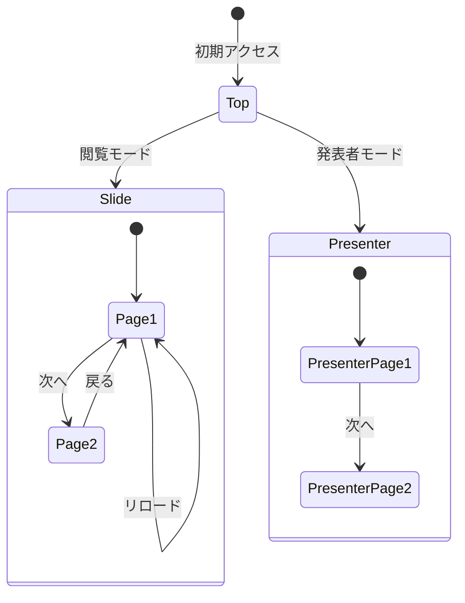

### 3. なぜこのアプローチを選んだか

| 観点 | 改善前の問題 | 改善後 |
|------|-------------|--------|
| **図の種類** | flowchartで状態遷移を表現しようとしている | 状態遷移には`stateDiagram-v2`が適切 |
| **自己参照** | `A --> A`は意図が不明確 | stateDiagramなら自己遷移（リロード）を自然に表現可能 |
| **関心の分離** | 3つの異なる概念が混在 | 目的別に分離し、それぞれ最適な図を選択 |

---

## 設計上の考慮点

### Mermaid図の選択指針
用途に応じた図の選択:
- システム構成・依存関係 → flowchart
- 状態遷移・ライフサイクル → stateDiagram-v2
- シーケンス・時系列処理 → sequenceDiagram
- クラス設計 → classDiagram
- ER図 → erDiagram